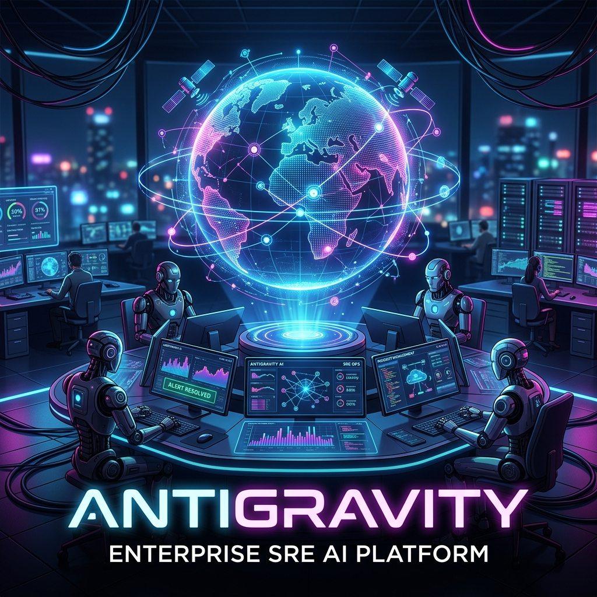
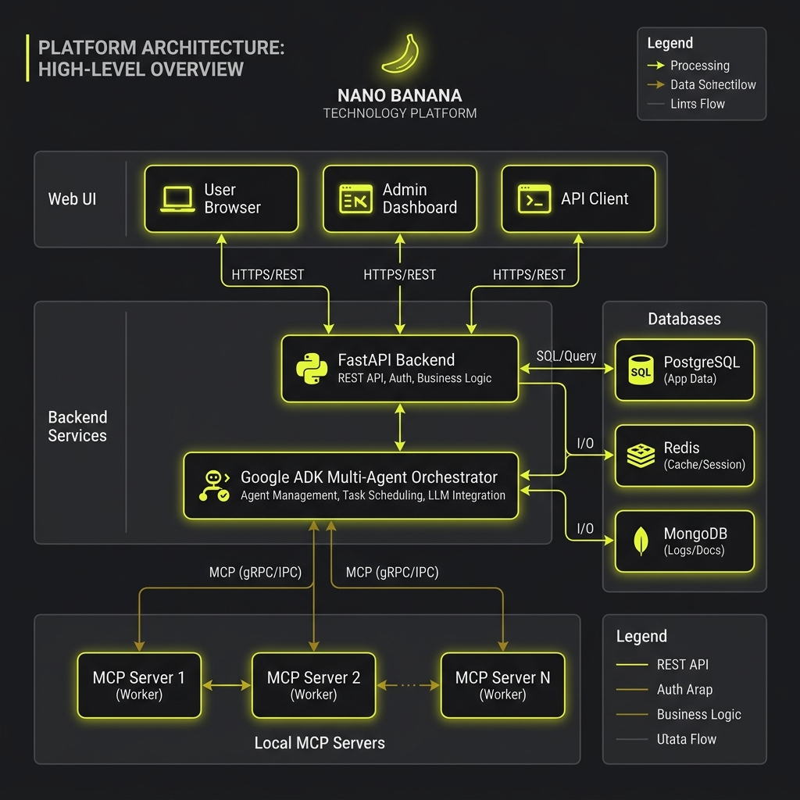
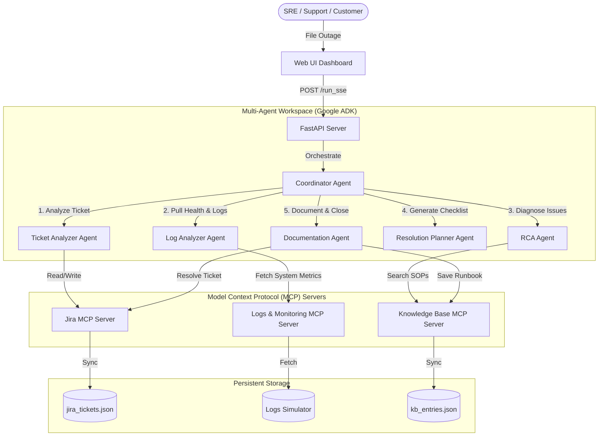
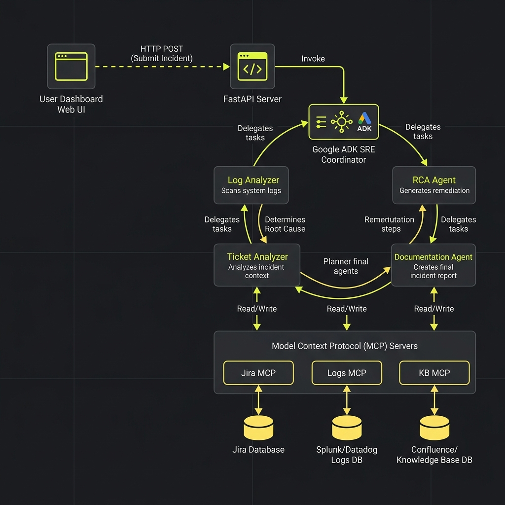
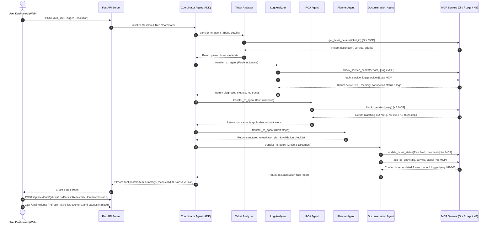

# 🚀 Antigravity: Enterprise-Grade AI Incident Management Platform



[](https://github.com/google/adk)
[](https://modelcontextprotocol.io)
[](https://fastapi.tiangolo.com)
[](https://www.python.org)
[](https://www.docker.com)

An industry-standard, production-ready **AI-Powered Incident Management Platform** designed to automate Software Development Life Cycle (SDLC) operations, Site Reliability Engineering (SRE) workflows, and incident triage. Built using the **Google Agent Development Kit (ADK)** and the **Model Context Protocol (MCP)**, this platform automates the diagnosis, planning, remediation, documentation, and state orchestration of enterprise production outages.

---

## 📖 Table of Contents
- [Overview](#-overview)
- [Motivation & Problem Statement](#-motivation--problem-statement)
- [System Architecture](#-system-architecture)
- [AI Multi-Agent Workflow](#-ai-multi-agent-workflow)
- [Key Features](#-key-features)
- [Technology Stack](#-technology-stack)
- [Supported Services & Incident Types](#-supported-services--incident-types)
- [AI Agent Directory & Ownership](#-ai-agent-directory--ownership)
- [Double-Versioned Responses](#-double-versioned-responses)
- [Incident Lifecycle & Status Management](#-incident-lifecycle--status-management)
- [Project Structure](#-project-structure)
- [Installation & Local Setup](#-installation--local-setup)
- [Configuration](#-configuration)
- [Usage Guide](#-usage-guide)
- [Testing & Code Quality](#-testing--code-quality)
- [Security & Performance](#-security--performance)
- [Future Scope & Roadmap](#-future-scope--roadmap)
- [Contributing & License](#-contributing--license)

---

## 🌟 Overview

**Antigravity** is a unified SRE control plane that automates incident resolution from ticket filing to runbook generation. It coordinates a team of five specialized AI agents to analyze alerts, query infrastructure logs, search standard operating procedures (SOPs), formulate step-by-step remediation plans, and perform automated status updates and documentation across tools like Jira and internal Knowledge Bases.

---

## 💡 Motivation & Problem Statement

### The Problem
In modern enterprise scale architectures, production outages cost thousands of dollars per minute. The traditional incident resolution pipeline suffers from:
1. **Alert Fatigue**: SREs are overwhelmed by raw logs and alert storms, delaying root-cause identification.
2. **Knowledge Silos**: Remediation procedures (SOPs) are scattered across Wikis, Confluence, and stale Markdown files.
3. **Manual Overhead**: Engineers waste critical minutes triaging tickets, updating Jira boards, informing stakeholders, and writing postmortems.
4. **Communication Gaps**: Engineers need technical logs and code fixes, whereas customers and business stakeholders require clear, non-technical updates about the outage impact and ETA.

### The Solution
**Antigravity** bridges these gaps by utilizing Google's AI models and the Model Context Protocol to orchestrate an autonomous SRE team. It reads, analyzes, diagnoses, drafts fixes, and documents outages in under a minute—providing double-versioned responses tailored specifically for both technical teams and business stakeholders.

---

## 🛠️ System Architecture

The platform operates on a three-tier architecture:
1. **Sleek Web Dashboard (Frontend)**: Real-time UI with a glassmorphic dark theme, featuring live SSE timeline streaming and dynamic incident status tracking.
2. **FastAPI & Google ADK (Agent Engine)**: Coordinates the hierarchical multi-agent SRE workflow.
3. **Model Context Protocol (MCP Servers)**: Local secure stdin/stdout transport adapters wrapping Jira, Logs/Monitoring, and the Operations Knowledge Base.





---

## 🤖 AI Multi-Agent Workflow

Every incident ticket runs through a highly structured, sequential workflow:





| Step | Agent | Role / Description |
| :--- | :--- | :--- |
| **1. Triage** | **Ticket Analyzer** | Parses the Jira ticket, classifies the incident category, extracts affected services, and identifies priority. |
| **2. Inspection** | **Log Analyzer** | Connects to the Logs MCP server to pull health indicators (CPU, memory, active connections) and stdout/stderr traces. |
| **3. Root Cause** | **RCA Agent** | Searches the KB MCP server for keywords and historical runbooks (e.g. S3 403s, DB deadlocks) to pinpoint the failure. |
| **4. Planning** | **Resolution Planner** | Drafts a step-by-step remediation plan containing immediate mitigations, environment configurations, and validation steps. |
| **5. Closure** | **Documentation Agent** | Marks the ticket as `Resolved` in Jira, posts the postmortem details, and logs the solution in the Knowledge Base for future lookups. |

---

## ✨ Key Features

* **Hierarchical Orchestration**: The lead coordinator dynamically routes workflows based on simulated logs.
* **Double-Versioned Postmortems**: Generates two distinct postmortem versions: a detailed technical analysis for engineers, and a customer-friendly impact overview for business stakeholders.
* **50+ Preloaded Enterprise Services**: Fully supports enterprise services from Authentication, Billing, Orders, and CDN, to Kubernetes, Message Queues, and AI/LLM Gateways.
* **Dynamic Logs Mocking**: The Log MCP dynamically creates realistic server logs and degraded health indicators for any service.
* **Centralized State Machine**: State transitions (Open $\rightarrow$ Resolved or Unresolved) are kept synchronized in the backend and frontend in real-time.
* **Live SSE Timeline**: Real-time streaming of agent thoughts and tool calls directly to the UI.
* **ADK Playground**: Full integration with the `/dev-ui/` developer playground for tracking tool invocations.

---

## 💻 Technology Stack

* **AI Agent Core**: [Google Agent Development Kit (ADK)](https://github.com/google/adk)
* **Model Communication**: [Google GenAI SDK](https://github.com/google/generative-ai-python) (running `gemini-2.5-flash`)
* **Tool Integration**: Model Context Protocol (MCP) using Python `FastMCP`
* **Backend Platform**: FastAPI & Uvicorn ASGI Server
* **Frontend Web Dashboard**: Vanilla HTML5, CSS3 (CSS Custom Properties, Custom SVG elements, Flexbox), and Vanilla JavaScript
* **Dependency Management**: `uv` package manager
* **Containerization**: Docker & Docker Compose

---

## 📂 Project Structure

```
incident-resolver/
├── app/
│   ├── app_utils/               # Telemetry and type validation utilities
│   ├── data/
│   │   ├── jira_tickets.json    # Mock Jira database (outages & logs comments)
│   │   └── kb_entries.json      # Knowledge Base repository (runbooks & SOPs)
│   ├── frontend/
│   │   ├── index.html           # Dashboard layout
│   │   ├── index.css            # Dark theme, glassmorphic UI, custom chevrons
│   │   └── index.js             # SSE stream consumer, DOM updates, state refresh
│   ├── mcp_servers/
│   │   ├── jira_mcp.py          # Jira ticket CRUD tools server
│   │   ├── logs_mcp.py          # Logs and Monitoring health metric tools server
│   │   └── kb_mcp.py            # Knowledge Base runbook search tools server
│   ├── agent.py                 # Hierarchical agent definitions (Google ADK)
│   └── fast_api_app.py          # Main backend, serves REST endpoints and UI
├── tests/                       # Unit and integration test suites
├── .env.example                 # Example configuration environment template
├── Dockerfile                   # Deployment build instruction file
├── docker-compose.yml           # Multi-container local orchestration
└── pyproject.toml               # Poetry/Hatch dependencies configuration
```

---

## 🔑 Configuration

Create a `.env` file in the root of the project:

```env
# Google AI Studio API Key (from https://aistudio.google.com/)
GOOGLE_API_KEY=your_gemini_api_key_here

# Direct LLM calls through Google AI Studio
GOOGLE_GENAI_USE_VERTEXAI=False
```

> [!IMPORTANT]
> **Gemini API Quota Recommendations:**
> The Gemini API **Free Tier** restricts keys to **15 Requests Per Minute (RPM)** and **1,500 Requests Per Day (RPD)** (or **5 RPM / 20 RPD** for some accounts). Because a multi-agent system runs sequential calls, it can hit these limits quickly. 
> To bypass this, we recommend upgrading your Google AI Studio project to the **Pay-As-You-Go** tier. Gemini 2.5 Flash is extremely inexpensive (usually under $0.005 for dozens of resolution runs).

---

## ⚡ Installation & Local Setup

### 1. Prerequisites
- **Python 3.11** or higher
- **uv** (Install via `pip install uv` or `powershell -c "irm https://astral.sh/uv/install.ps1 | iex"`)
- **Google Gemini API Key**

### 2. Install Project Dependencies
Run the SRE agent installer command to configure your virtual environment:
```bash
# Sync dependencies and configure venv
agents-cli install
```

### 3. Run the Platform
Start the FastAPI server:
```bash
uv run python app/fast_api_app.py
```

The application will start. Open your web browser and navigate to:
- **Enterprise Dashboard**: [http://localhost:8000/](http://localhost:8000/)
- **Google ADK Dev UI Playground**: [http://localhost:8000/dev-ui/](http://localhost:8000/dev-ui/)

---

## 🖥️ Usage Guide

### Filing a Ticket
1. Navigate to the **Report Incident** tab in the sidebar.
2. Select any of the **50+ services** (e.g. `Kubernetes Cluster`, `Kafka/Event Streaming`, `Identity Provider (SSO)`).
3. Choose a Priority Level (`Low`, `Medium`, `High`, `Critical`).
4. Type a summary and description (e.g. *"SSO login token returns 403 Forbidden"*).
5. Click **File Ticket**. The incident will be registered in the backend as `Open`.

### Troubleshooting and Resolution
1. Go back to the **Dashboard** page.
2. Select your newly filed ticket from the scrollable list on the left.
3. Click the blue **Resolve with Multi-Agents** button.
4. Watch the agent execution timeline update. On completion, the dashboard will automatically refresh:
   * The status badge turns to green **`Resolved`**.
   * Postmortem summaries are logged under **Jira Logs & Comments**.
   * A new runbook is saved under the **Knowledge Base** tab (e.g. `KB-006`).

---

## 🗂️ Supported Services & Incident Categories

The platform simulates and generates dynamic diagnostic outputs for the following architectures:

### Catalog of 50 Services
* **Auth & Security**: Identity Provider (SSO), Authentication Service, Profile Service, SSL Certificate Management.
* **Business & Retail**: Billing Service, Payment Service, Order Service, Subscription Service, Inventory Service.
* **Infrastructure**: Kubernetes Cluster, Load Balancer, API Gateway, CDN, Redis Cache, Event Streaming (Kafka), Monitoring Service, Object Storage (S3).
* **Communication & Messaging**: Notification Service, Email Service, SMS Service, Slack Integration, Webhooks.

### Outage Categories
* **Application Crashes**: Memory leaks, CPU spikes, Kubernetes pod crash loops, unhandled exceptions.
* **Network & Gateway**: 502 Bad Gateway, 503 Service Unavailable, 504 Gateway Timeout, DNS failures.
* **Data & Cache**: Database connection pool exhaustion, SQL deadlocks, slow query lag, Kafka consumer latency.
* **Security & Assets**: 403 Forbidden S3 uploads, expired SSL certificates, Auth token expiration.

---

## 📈 Incident Status Lifecycle

Every incident in the platform follows a strict state machine to prevent discrepancies:

```
                  [ Ticket Created ]
                         │
                         ▼
                   🟠 status: Open
                         │
         ┌───────────────┴───────────────┐
         ▼                               ▼
    [ Success ]                     [ Failure ]
  (All agents complete)           (429 API quota error / Exception)
         │                               │
         ▼                               ▼
   🟢 status: Resolved             🔴 status: Unresolved
         │                               │
         └───────────────┬───────────────┘
                         │
                 [ Click "Reset" ]
                         │
                         ▼
                   🟠 status: Open
```

* **`🟠 Open`**: Incident is filed and ready to be investigated.
* **`🟢 Resolved`**: Agent workflow completed successfully. The Jira ticket is updated and the runbook is written to the Knowledge Base.
* **`🔴 Unresolved`**: The workflow failed (e.g. model rate limits, API timeout, validation failure). It logs the crash description in Jira, allowing engineers to reset and try again.

---

## 📝 Double-Versioned Response Example

When the multi-agent system completes, it generates two separate postmortems:

### 👥 Business Response
> **What Happened**: The User Profile upload service was rejecting customer avatar updates with a "403 Access Denied" warning.
> **Why It Happened**: The S3 Bucket permissions were missing the `s3:PutObject` parameter on the backend bucket role.
> **Impact & Action**: Outage resolved in 15 minutes. Primary owner "Security Ops" has re-applied the Terraform policy module. No customer action is required.

### 💻 Technical Response
> **Predicted Root Cause**: AWS IAM Role policy drift on bucket `user-avatars-prod`.
> **Logs Analysed**: `ERROR UploadHandler: Failed to store avatar in S3. Reason: 403 Forbidden`
> **Configuration Remediation**: Add `s3:PutObject` permission block to the IAM Role template.
> **Suggested Commands**:
> ```bash
> terraform plan -target=module.s3_avatars
> terraform apply -auto-approve
> aws s3api get-bucket-cors --bucket user-avatars-prod
> ```

---

## 🧪 Testing & Code Quality

Antigravity enforces strict code style, typing, and safety guidelines.

Run the test suite and quality checkers locally:
```bash
# Run unit and integration tests
uv run pytest

# Run linter and formatting checks
agents-cli lint
```

The linting pipeline checks:
1. **Ruff**: Enforces import ordering, code style, and code formatting rules.
2. **Codespell**: Scans the codebase for typos and misspellings.
3. **Type Check (`ty`)**: Runs static analysis to ensure perfect Python typing.

---

## 🔒 Security & Performance Considerations

* **Local MCP Security**: MCP servers run locally over standard input/output (`stdio`) transport. They do not expose network ports or external API listeners, protecting your internal infrastructure databases.
* **Credential Isolation**: All API keys and secrets are loaded securely from the environment and kept isolated from public Git trees via `.gitignore`.
* **State Compression**: The ADK framework optimizes token usage by packing and pruning old events dynamically, preventing token budget exhaustion during long agent conversations.

---

## 🐳 Docker Deployment

To spin up the entire platform in a containerized production environment:

1. Build and run using Docker Compose:
   ```bash
   docker-compose up --build
   ```
2. The FastAPI container will expose the platform locally at `http://localhost:8000`.

---

## 🤝 Contributing

Contributions to improve the SRE multi-agent flows or expand the MCP capabilities are welcome! Please follow these guidelines:
1. Fork the repository.
2. Create your feature branch (`git checkout -b feature/amazing-agent`).
3. Format and lint your changes using `agents-cli lint`.
4. Commit your changes and open a Pull Request.

---

## 📄 License

This project is licensed under the Apache License 2.0. See the `LICENSE` file for details.

---

## 📧 Contact & Support

For questions, troubleshooting, or feedback regarding the multi-agent orchestration, feel free to open a GitHub issue or contact the team at **support@antigravity.ai**.
